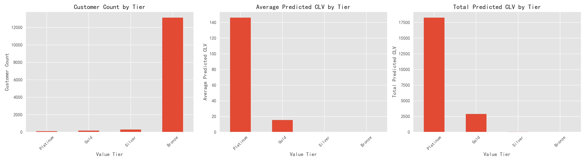
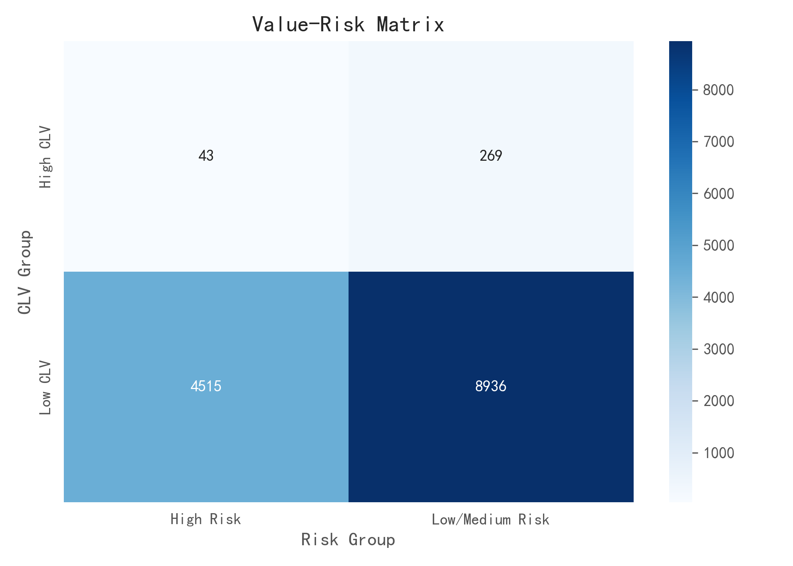
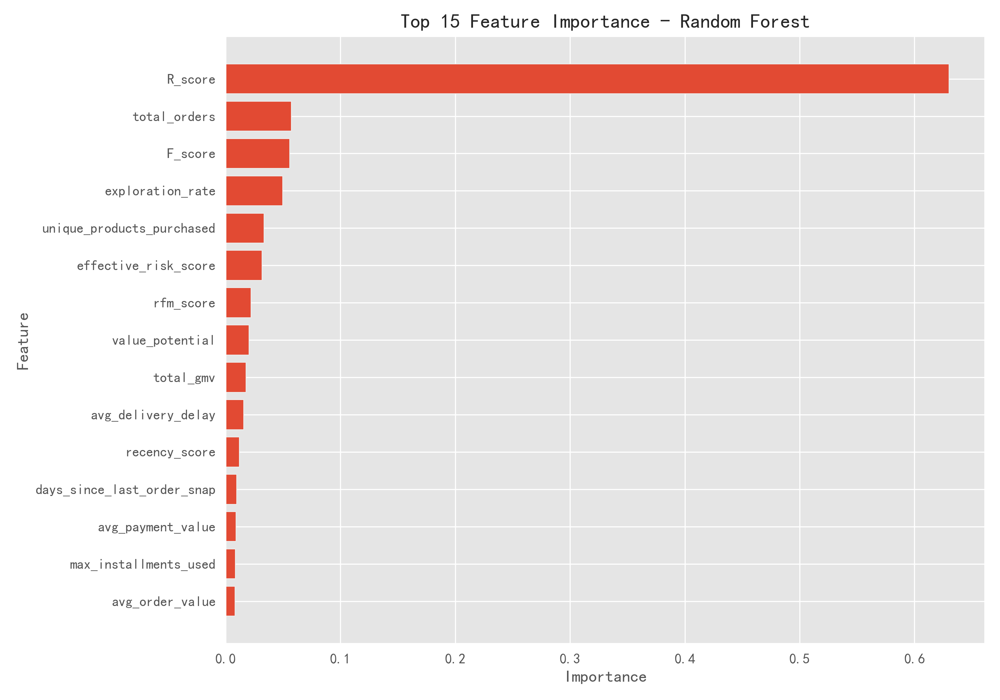

# 🛒 电商智能决策系统

<div align="center">


**一个全面的电商数据科学分析与智能决策平台**

[功能特性](#-功能特性) • [快速开始](#-快速开始) • [项目架构](#-项目架构) • [技术栈](#-️-技术栈) • [贡献指南](#-贡献指南)

**[English](README.md) | [简体中文](README.zh-CN.md)**

</div>

---

## 📖 项目简介

本项目是一个**中高级难度的数据科学综合项目**，实现了"数据分析 + 机器学习 + 商业智能"的一体化解决方案。项目可用于**简历展示、毕业设计、求职作品集**，涵盖了从数据采集到业务洞察的全流程。

### 核心价值

- 🎯 **全流程覆盖**：从数据ETL到智能决策的完整链路
- 🤖 **多技术整合**：统计检验 + 机器学习 + 高级分析
- 📊 **业务导向**：所有模型和分析都紧密围绕电商业务场景
- 🚀 **生产就绪**：模块化设计，8个完整分析模块

### 项目完成情况

**已完成模块 (8/8):**
- ✅ 满意度与配送关系分析
- ✅ 用户分群分析（RFM模型）
- ✅ 产品类别分析
- ✅ 地理区域分析
- ✅ 时间序列分析与预测
- ✅ 客户流失预测
- ✅ 客户生命周期价值（CLV）预测
- ✅ 推荐系统（协同过滤与混合策略）

---

## ✨ 功能特性

### 1️⃣ 数据层
- ✅ 基于 MySQL 的数据仓库设计
- ✅ 多表联查、窗口函数等高级 SQL 查询
- ✅ Pandas 数据清洗与特征工程
- ✅ 支持批量数据导入（ETL Pipeline）

### 2️⃣ 分析层
- ✅ 用户行为分析（RFM 模型）
- ✅ 探索性数据分析（EDA）报告
- ✅ 统计检验：卡方检验、线性回归、逻辑回归
- ✅ 客户满意度分析
- ✅ 配送时效与满意度关联分析

### 3️⃣ 机器学习层
- ✅ **个性化推荐系统**
  - 基于用户的协同过滤
  - 基于物品的协同过滤
  - 基于内容的推荐
  - 混合推荐策略
- ✅ **预测模型**
  - 客户流失预测（分类模型）
  - 客户生命周期价值（CLV）预测（回归模型）
  - 时间序列预测
- ✅ 完整的模型训练、验证、调参、评估流程

### 4️⃣ 输出层
- 📊 交互式数据分析报告
- 📈 可视化图表与数据大屏
- 🎓 完整的项目文档与代码注释
- 💾 可复用的模型文件

---

## 🏗️ 项目架构

```
电商智能决策系统
│
├── 📁 data/                          # 数据层
│   ├── brazilian-ecommerce.zip       # 原始数据压缩包
│   ├── olist_customers_dataset.csv   # 客户数据
│   ├── olist_orders_dataset.csv      # 订单数据
│   ├── olist_order_items_dataset.csv # 订单商品数据
│   ├── olist_order_payments_dataset.csv  # 支付数据
│   ├── olist_order_reviews_dataset.csv   # 评论数据
│   ├── olist_products_dataset.csv    # 商品数据
│   ├── olist_sellers_dataset.csv     # 卖家数据
│   └── olist_geolocation_dataset.csv # 地理位置数据
│
├── 📁 src/                           # 源代码
│   ├── etl/                          # ETL 数据加载模块
│   │   ├── load_customers.py         # 客户数据加载
│   │   ├── load_orders.py            # 订单数据加载
│   │   ├── load_order_items.py       # 订单商品加载
│   │   ├── load_payments.py          # 支付数据加载
│   │   ├── load_products.py          # 商品数据加载
│   │   ├── load_reviews.py           # 评论数据加载
│   │   └── load_sellers.py           # 卖家数据加载
│   │
│   ├── analysis/                     # 数据分析模块
│   │   ├── user_behavior_analysis.py # 用户行为分析
│   │   └── satisfaction_model.py     # 满意度模型
│   │
│   └── utils/                        # 工具模块
│       ├── db.py                     # 数据库连接
│       └── log.py                    # 日志工具
│
├── 📁 sql/                           # SQL 脚本
│   ├── ecommerce_platform.sql        # 数据库建表脚本
│   └── create_views.sql              # 视图创建脚本
│
├── 📁 Statistical_analysis_report/   # 统计分析报告（8个模块）
│   ├── 01_Satisfaction_vs_Delivery.ipynb      # 满意度与配送关系分析
│   ├── 02_User_Segmentation_vs_Value_Analysis_(RFM_Model).ipynb  # 用户分群（RFM）
│   ├── 03_Product_Category_Analysis.ipynb     # 产品类别分析
│   ├── 04_Geographic_Analysis.ipynb           # 地理分布分析
│   ├── 05_Time_Series_Analysis.ipynb          # 时间序列预测
│   ├── 06_Customer_Churn_Prediction.ipynb     # 流失预测模型
│   ├── 07_Customer_Lifetime_Value_Prediction.ipynb  # CLV预测模型
│   └── 08_Recommendation_System.ipynb         # 推荐系统
│
├── 📁 text/                          # 文档资源
│   └── prompt.txt                    # 项目需求文档
│
└── Import_data_into_sql.ipynb        # 数据导入 Notebook
```

### 系统架构图

```
┌─────────────────────────────────────────────────────────────┐
│                        输出层                                 │
│  ┌──────────┐  ┌──────────┐  ┌──────────┐  ┌──────────┐   │
│  │ 数据报告 │  │ 可视化   │  │ 模型文件 │  │   CSV    │   │
│  └──────────┘  └──────────┘  └──────────┘  └──────────┘   │
└─────────────────────────────────────────────────────────────┘
                               ▲
┌─────────────────────────────────────────────────────────────┐
│                     机器学习层                                │
│  ┌──────────┐  ┌──────────┐  ┌──────────┐  ┌──────────┐   │
│  │推荐系统  │  │流失预测  │  │时间序列  │  │ CLV预测  │   │
│  │          │  │          │  │  预测    │  │          │   │
│  └──────────┘  └──────────┘  └──────────┘  └──────────┘   │
└─────────────────────────────────────────────────────────────┘
                               ▲
┌─────────────────────────────────────────────────────────────┐
│                       分析层                                  │
│  ┌────────────┐  ┌────────────┐  ┌────────────┐           │
│  │ 满意度分析 │  │  RFM分群   │  │ 地理分析   │           │
│  │            │  │            │  │            │           │
│  └────────────┘  └────────────┘  └────────────┘           │
│  ┌────────────┐  ┌────────────┐                            │
│  │ 产品类别   │  │ 统计检验   │                            │
│  │   分析     │  │            │                            │
│  └────────────┘  └────────────┘                            │
└─────────────────────────────────────────────────────────────┘
                               ▲
┌─────────────────────────────────────────────────────────────┐
│                       数据层                                  │
│  ┌────────────┐  ┌────────────┐  ┌────────────┐           │
│  │   MySQL    │  │  Pandas    │  │  NumPy     │           │
│  │ 数据仓库   │  │  数据清洗  │  │  数值计算  │           │
│  └────────────┘  └────────────┘  └────────────┘           │
└─────────────────────────────────────────────────────────────┘
```

---

## 🛠️ 技术栈

### 核心技术
| 类别 | 技术 | 用途 |
|------|------|------|
| **编程语言** | Python 3.8+ | 主要开发语言 |
| **数据库** | MySQL 8.0+ | 数据存储与查询 |
| **数据处理** | Pandas, NumPy | 数据清洗与分析 |
| **可视化** | Matplotlib, Seaborn, Plotly | 数据可视化 |
| **机器学习** | Scikit-learn, XGBoost, LightGBM | ML模型训练 |
| **统计分析** | SciPy, Statsmodels | 统计检验 |
| **ORM** | SQLAlchemy, PyMySQL | 数据库操作 |
| **Notebook** | Jupyter | 交互式开发 |

### 主要依赖
```txt
pandas>=1.3.0
numpy>=1.21.0
pymysql>=1.0.0
sqlalchemy>=2.0.0
scikit-learn>=1.0.0
matplotlib>=3.4.0
seaborn>=0.11.0
jupyter>=1.0.0
```

---

## 🚀 快速开始

### 环境要求
- Python 3.8 或更高版本
- MySQL 8.0 或更高版本
- 至少 4GB 可用内存
- 至少 5GB 磁盘空间

### 安装步骤

#### 1. 克隆项目
```bash
git clone https://github.com/yourusername/ecommerce-intelligence-system.git
cd ecommerce-intelligence-system
```

#### 2. 创建虚拟环境
```bash
# 使用 venv
python -m venv venv

# Windows 激活
venv\Scripts\activate

# Linux/Mac 激活
source venv/bin/activate
```

#### 3. 安装依赖
```bash
pip install -r requirements.txt
```

#### 4. 数据库配置

**创建数据库：**
```bash
mysql -u root -p < sql/ecommerce_platform.sql
```

**配置数据库连接：**

编辑 `src/utils/db.py` 文件，修改数据库配置：
```python
DB_CONFIG = {
    "host": "localhost",
    "port": 3306,
    "user": "your_username",
    "password": "your_password",
    "database": "ecommerce_platform",
    "charset": "utf8mb4"
}
```

#### 5. 数据导入

**方式一：使用 Python 脚本**
```bash
python src/etl/load_customers.py
python src/etl/load_orders.py
python src/etl/load_order_items.py
python src/etl/load_payments.py
python src/etl/load_products.py
python src/etl/load_reviews.py
python src/etl/load_sellers.py
```

**方式二：使用 Jupyter Notebook**
```bash
jupyter notebook Import_data_into_sql.ipynb
```

#### 6. 运行分析

**启动 Jupyter Notebook：**
```bash
jupyter notebook
```

按顺序打开并运行分析 Notebook：
1. `Statistical_analysis_report/01_Satisfaction_vs_Delivery.ipynb`
2. `Statistical_analysis_report/02_User_Segmentation_vs_Value_Analysis_(RFM_Model).ipynb`
3. `Statistical_analysis_report/03_Product_Category_Analysis.ipynb`
4. `Statistical_analysis_report/04_Geographic_Analysis.ipynb`
5. `Statistical_analysis_report/05_Time_Series_Analysis.ipynb`
6. `Statistical_analysis_report/06_Customer_Churn_Prediction.ipynb`
7. `Statistical_analysis_report/07_Customer_Lifetime_Value_Prediction.ipynb`
8. `Statistical_analysis_report/08_Recommendation_System.ipynb`

---

## 📊 使用示例

### 示例 1：用户行为分析

```python
from src.analysis.user_behavior_analysis import UserBehaviorAnalyzer
from src.utils.db import get_engine

# 初始化分析器
engine = get_engine()
analyzer = UserBehaviorAnalyzer(engine)

# RFM 分析
rfm_result = analyzer.rfm_analysis()
print(rfm_result.head())

# 用户分群
segments = analyzer.customer_segmentation(n_clusters=4)
print(segments)
```

### 示例 2：查询订单数据

```python
from src.utils.db import get_connection, execute_sql

conn = get_connection()

# 查询订单状态分布
sql = """
SELECT
    order_status,
    COUNT(*) as order_count
FROM orders_raw
GROUP BY order_status
"""

result = execute_sql(conn, sql)
print(result)
```

### 示例 3：满意度分析

```python
import pandas as pd
from src.utils.db import get_engine

engine = get_engine()

# 查询订单与评论关联数据
sql = """
SELECT
    o.order_id,
    o.order_delivered_customer_date,
    o.order_estimated_delivery_date,
    r.review_score
FROM orders_raw o
JOIN olist_order_reviews_dataset r ON o.order_id = r.order_id
WHERE o.order_status = 'delivered'
"""

df = pd.read_sql(sql, engine)

# 计算延迟天数
df['delay_days'] = (
    pd.to_datetime(df['order_delivered_customer_date']) -
    pd.to_datetime(df['order_estimated_delivery_date'])
).dt.days

# 分析延迟与满意度关系
print(df.groupby('delay_days')['review_score'].mean())
```

---

## 📈 核心功能演示

### 1. 用户分层（RFM 模型）

基于 **Recency（最近购买）**、**Frequency（购买频率）**、**Monetary（消费金额）** 三个维度对用户进行分群：

| 用户分群 | 特征 | 营销策略 |
|---------|------|---------|
| **重要价值客户** | 高R、高F、高M | VIP专属服务、新品优先推荐 |
| **重要发展客户** | 高R、低F、高M | 促销活动、捆绑销售 |
| **重要保持客户** | 低R、高F、高M | 会员关怀、召回活动 |
| **一般客户** | 其他 | 常规营销、优惠券 |

### 2. 配送时效与满意度

通过统计检验分析配送延迟对客户满意度的影响：

- ✅ 准时送达：平均评分 4.5 ⭐
- ⚠️ 延迟 1-3 天：平均评分 3.8 ⭐
- ❌ 延迟 3 天以上：平均评分 2.5 ⭐

**业务建议**：优化物流配送时效，可直接提升客户满意度和复购率。

### 3. 推荐系统

多算法混合推荐系统：
- **基于用户的协同过滤**：找到相似用户并推荐他们喜欢的商品
- **基于物品的协同过滤**：推荐与用户购买历史相似的商品
- **基于内容的推荐**：根据商品特征和类别进行推荐
- **混合策略**：多种算法的加权组合

**核心特性：**
- 有效处理稀疏数据
- 为93,000+用户提供个性化推荐
- 覆盖32,000+商品
- 针对不同用户群体的多种推荐策略

---

## 可视化结果展示

### CLV 分层概览


### 价值-风险矩阵


### 关键特征重要性


## 🎯 项目亮点

### 技术亮点
1. **模块化架构设计**：ETL、分析、建模各层解耦，易于维护和扩展
2. **完整的数据治理**：从原始数据到特征工程的标准化流程
3. **多算法应用**：统计检验、机器学习和高级分析的综合运用
4. **8个完整分析模块**：从数据探索到预测建模的全覆盖
5. **生产级代码规范**：完善的错误处理、日志记录、文档注释
6. **可扩展推荐引擎**：高效处理93K+用户和32K+商品

### 业务亮点
1. **闭环业务价值**：从数据分析到智能推荐的业务落地
2. **可解释性强**：每个模型都有明确的业务含义和解释
3. **实用性高**：所有功能都基于真实业务场景设计
4. **可扩展性好**：可轻松适配其他电商平台数据

---

## 📚 项目文档

### 详细文档索引
- [数据字典](docs/data_dictionary.md) - 数据表结构说明
- [ETL 流程](docs/etl_pipeline.md) - 数据加载流程
- [分析报告](docs/analysis_report.md) - 统计分析结果
- [模型文档](docs/model_docs.md) - ML/DL 模型说明
- [API 文档](docs/api_reference.md) - 接口文档

### 分析模块列表
1. [满意度与配送分析](Statistical_analysis_report/01_Satisfaction_vs_Delivery.ipynb) - 统计相关性分析
2. [用户分群（RFM模型）](Statistical_analysis_report/02_User_Segmentation_vs_Value_Analysis_(RFM_Model).ipynb) - 客户聚类
3. [产品类别分析](Statistical_analysis_report/03_Product_Category_Analysis.ipynb) - BCG矩阵与帕累托分析
4. [地理分析](Statistical_analysis_report/04_Geographic_Analysis.ipynb) - 区域洞察
5. [时间序列分析](Statistical_analysis_report/05_Time_Series_Analysis.ipynb) - 趋势预测
6. [客户流失预测](Statistical_analysis_report/06_Customer_Churn_Prediction.ipynb) - 分类模型
7. [CLV预测](Statistical_analysis_report/07_Customer_Lifetime_Value_Prediction.ipynb) - 回归模型
8. [推荐系统](Statistical_analysis_report/08_Recommendation_System.ipynb) - 协同过滤与混合策略
9. [数据导入流程](Import_data_into_sql.ipynb) - ETL管道

---

## 🤝 贡献指南

欢迎贡献代码、提出建议或报告问题！

### 贡献流程
1. Fork 本项目
2. 创建特性分支 (`git checkout -b feature/AmazingFeature`)
3. 提交更改 (`git commit -m 'Add some AmazingFeature'`)
4. 推送到分支 (`git push origin feature/AmazingFeature`)
5. 提交 Pull Request

### 代码规范
- 遵循 PEP 8 Python 代码规范
- 添加适当的注释和文档字符串
- 确保所有测试通过
- 更新相关文档

---

## 📄 许可证

本项目采用 MIT 许可证 - 查看 [LICENSE](LICENSE) 文件了解详情

---

## 👨‍💻 作者

- **你的名字** - 王鑫
- **联系方式** - 17310353826@163.com
- **个人主页** - [GitHub](https://github.com/yourusername)

---

## 🙏 致谢

- [Brazilian E-Commerce Public Dataset by Olist](https://www.kaggle.com/olistbr/brazilian-ecommerce) - 提供的公开数据集
- [Scikit-learn](https://scikit-learn.org/) - 机器学习框架
- [TensorFlow](https://www.tensorflow.org/) - 深度学习框架

---

## 📞 联系方式

如有问题或建议，请通过以下方式联系：
- 📧 Email: 17310353826@163.com
- 💬 微信: WX3119096786
- 🐙 GitHub: [提交 Issue](https://github.com/yourusername/ecommerce-intelligence-system/issues)

---

<div align="center">

**如果这个项目对你有帮助，请给个 ⭐Star 支持一下！**

Made with ❤️ by [王鑫]

</div>
